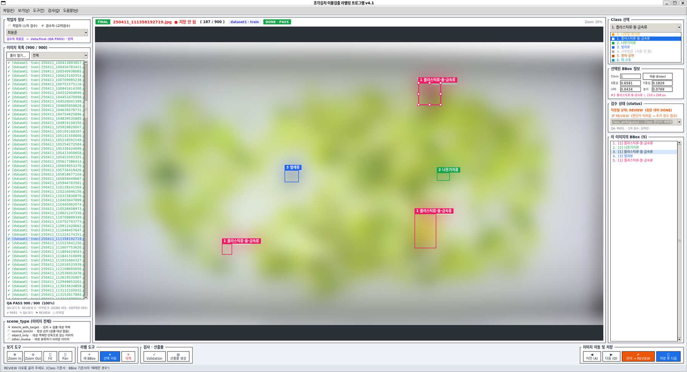

# 조각김치 이물검출 라벨링 프로그램 (v4.1)

### [이 데이터는 교육용으로 제작된 100% 가상 데이터입니다]

조각김치 이미지 900장의 이물질 BBox 라벨을 **검수 · 수정 · 교차검수**하고,
산출물(**Dataset Manifest · QA Summary · Test Report · Handoff**)까지 만들어 주는 팀 프로젝트입니다.


<p align="center">
  
  <br><sub>라벨링 프로그램 실행 화면 (v4.1 · 사진 영역 blur) — 검수자 교차검수 · REVIEW 사유 선택 · BBox 5개</sub>
</p>

---

<h2>1. 프로젝트 소개 <a href="https://www.figma.com/design/1B9QcM36Ne1j5sTHXcOAAV/1%25EC%25A1%25B0?node-id=160-143&t=7V3xsWXdhC4pMg7t-0"></a></h2>

| 항목 | 내용 |
|---|---|
| 대상 | 조각김치 이미지 900장 (기존 데이터셋 여러 개 · train / validation) |
| 목표 | 기존 YOLO 라벨을 검수 · 수정 → **QA PASS 데이터만** `data/final` 에 정리 → Final Model(YOLO 학습)로 전달 |
| 라벨 형식 | YOLO TXT (`class x_center y_center width height`, 0~1) |
| 팀 | 최용훈(팀장) · 박건 · 이승훈 · 김하민 · 심준형 |

## 2. 주요 기능

| 구분 | 기능 |
|---|---|
| 라벨 편집 | 이미지 열기 · 기존 TXT Load · BBox 추가/수정/삭제 · Class 변경 · Zoom/Pan · 되돌리기 · 저장 후 Reload 확인 |
| 1차 검수 (작업자) | 저장하면 `data/work` 에만 저장 · **status 자동 판정** (DONE / EDITED) · REVIEW 체크 + 사유 선택 |
| 교차검수 (검수자) | **QA PASS** → `data/final/images + labels` 한 쌍 저장 · **반려** → REVIEW 로 되돌림 (본인이 1차 검수한 이미지는 PASS 불가) |
| 작업대장 | `data/manifests/dataset_manifest.csv` 자동 관리 (file_name[파일명], source_dataset[원본 데이터셋], original_split[기존 train/validation 분할], scene_type[이미지 유형], worker[1차 작업자], status[1차 검수 상태], qa_status[교차검수 상태], review_reason[REVIEW 사유]) |
| 작업 이력 | `data/manifests/label_history.csv` — 누가 · 언제 · 무엇을 했는지 계속 쌓임 |
| 이미지 목록 필터 | 전체 / 미작업 / QA 대기 / REVIEW / QA PASS / 1차 검수자 표시 |
| 전체 Validation (F7) | 900장을 8가지 오류 종류로 검사 → 실패 목록 더블클릭으로 바로 이동 및 실행 기록 저장 |
| 자동 테스트 | Golden 20장 · Pilot 50장으로 12개 기능 자동 점검 (원본은 바꾸지 않음) |
| 산출물 생성 | `manifests/dataset_manifest.csv` · `reports/qa_summary.md` · `reports/test_report.md` · `docs/subject08_handoff.md` |
| 팀 결과 합치기 | 현재 결과를 zip 으로 묶고 저장(원본 이미지 제외)및 zip 불러오기 기능 |

## 3. 폴더 구조

```
prj07_team01/ 
├── main.py                           # 프로그램 시작
├── requirements.txt                  # pillow, pyyaml
├── configs/
│   └── classes.yaml                  # Class · 팀원 · scene_type · review_reason · 팀 규칙
├── src/
│   ├── ui/          main_window.py (화면 · 버튼) · canvas.py (이미지 · 마우스) · validation_window.py (검사 결과 창)
│   ├── bbox/        bbox_manager.py (BBox 데이터) · bbox_editor.py (드래그 편집)
│   ├── yolo/        yolo_loader.py (데이터 폴더 · TXT 읽기) · yolo_writer.py (work / final 저장)
│   ├── validation/  validator.py (한 장 검사 · 전체 Validation)
│   ├── records/     manifest.py (작업대장) · history.py (작업 이력)
│   └── qa/          self_test.py (Golden · Pilot 자동 테스트) · reports.py (산출물 생성)
├── tools/
│   ├── make_reports.py               # 화면 없이 산출물 만들기
│   ├── merge_results.py              # 팀원 결과 묶기(pack) · 합치기(merge)
│   └── label_stats.py                # RAW vs FINAL 라벨 통계 (Class별 BBox · 변경 내역 · RAW 점검)
├── docs/
│   ├── project_baseline.md           # 팀 기준
│   ├── class_guide.md                # Class 기준서
│   ├── bbox_guide.md                 # BBox 기준서
│   ├── subject08_handoff.md          # (자동 생성) 교과 8 전달 문서
│   ├── git_commit_log.md             # Git 커밋 이력 (2번 산출물 증빙 · 팀원별 · 날짜별)
│   ├── FINAL_YOLO_Label_Evidence.md  # 최종 라벨링 증빙 문서
│   └── FINAL_YOLO_images/            # 최종 라벨링 증빙 문서 삽입 이미지
├── manifests/
│   ├── dataset_manifest.csv          # (자동 생성) 제출용 작업대장 사본
│   ├── label_history.csv             # (자동 생성) 라벨 저장·검수 이력 (누가·언제·무엇을)
│   └── validation_runs.csv           # (자동 생성) Validation(F7) 실행 기록 - 최초 vs 최종 비교
├── reports/
│   ├── qa_summary.md                 # (자동 생성) QA Summary - Data QA
│   ├── test_report.md                # (자동 생성) Test Report
│   └── validation_report.csv         # (자동 생성) Validation 실패 목록
├── daily_csv/ · qa_csv/              # 일일 작업 · Program QA 기록
│
└── data/                             # ⚠ Git 에 올리지 않음 (.gitignore)
    ├── raw/                          # 원본 데이터셋 (읽기 전용, 절대 수정 금지)
    │   ├── 이물검출_학습데이터1/images/train/*.jpg
    │   │                       labels/train/*.txt
    │   └── 이물검출_학습데이터2/images/validation/*.jpg ...
    ├── work/labels/                  # 1차 검수 결과 (작업자 저장)
    ├── final/images/                 # QA PASS 이미지 (raw 에서 복사)
    └── final/labels/                 # QA PASS TXT
```

## 4. 설치 방법

```bash
# WSL / Ubuntu
sudo apt install python3-tk python3-venv   # tkinter · venv 가 없을 때만

# 프로젝트 폴더에서
python3 -m venv .venv                      # 1) 가상환경 만들기
source .venv/bin/activate                  # 2) 켜기 → 앞에 (.venv) 표시
pip install -r requirements.txt            # 3) 패키지 설치 (pillow, pyyaml)
```

## 5. 실행 방법

```bash
python main.py
```

처음 한 번만: 원본 데이터셋 폴더를 `data/raw/` 안에 **복사**해 넣습니다. (원래 폴더 모양 그대로)

## 6. 사용 순서

1. 왼쪽 위 **작업자 정보**에서 `작업자(1차 검수)` 또는 `검수자(교차검수)`를 고르고 이름을 고릅니다.
2. **파일 > data 폴더 열기 (Ctrl+O)** → `data` 폴더를 선택합니다. (raw 안의 데이터셋이 하나의 목록으로 모입니다)
3. 목록 위 **필터**로 내가 할 이미지만 봅니다. (작업자: `미작업`, 검수자: `QA 대기` / `REVIEW`)
4. BBox 를 확인 · 수정하고 왼쪽 아래 **scene_type** 을 고릅니다.
5. 판단이 어려우면 오른쪽 **REVIEW** 를 체크하고 **review_reason** 을 고릅니다.
6. **저장 (Ctrl+S)** 또는 **저장 후 다음 (Ctrl+Enter)**
   - 작업자: `저장 → WORK` (초록)
   - 검수자: `QA PASS → FINAL` (보라) / REVIEW 체크 시 `반려 → REVIEW` (주황)
7. 하루 작업이 끝나면 **F7 전체 Validation** → 실패 항목을 더블클릭해서 수정
8. **파일 > 내 결과 묶음 만들기** → zip 을 팀장에게 전달 → 팀장이 **팀원 결과 묶음 합치기**
9. 팀장: **검사 > 산출물 생성** → `reports/`, `manifests/`, `docs/` 를 커밋

## 7. 상태 값 (dataset_manifest.csv)

```csv
file_name,source_dataset,original_split,scene_type,worker,status,qa_status,review_reason
250410_144403911987.jpg,dataset2,train,kimchi_with_target,박건,DONE,PASS,
250410_144405445566.jpg,dataset1,train,object_only,이승훈,REVIEW,WAIT,class_ambiguous
```

| 컬럼 | 값 | 누가 · 어떻게 정해지나 |
|---|---|---|
| `source_dataset` · `original_split` | `dataset1` · `train` | 폴더 위치에서 **자동** |
| `scene_type` | 아래 표 | 작업자 / 검수자가 선택 |
| `worker` | 1차 검수 작업자 | 작업자 저장 시 **자동** (검수자 반려 · PASS 때는 바뀌지 않음) |
| `status` | `DONE` | 원본 라벨과 **똑같으면** 자동 (수정 없이 검수 완료) |
| | `EDITED` | 원본과 **다르면** 자동 (BBox 수정 · 추가 · 삭제 · Class 변경) |
| | `REVIEW` | REVIEW 체크 시 (사유 필수) |
| | (빈칸) | 아직 1차 검수 전 |
| `qa_status` | `WAIT` → `PASS` | 작업자 저장 · 반려 시 `WAIT`, 검수자 QA PASS 시 `PASS` |
| `review_reason` | 아래 표 | status 가 REVIEW 일 때만 |

| scene_type | 의미 |
|---|---|
| `kimchi_with_target` | 김치 + 검출 대상 객체 |
| `normal_kimchi` | 정상 김치 (검출 대상 없음 → 빈 TXT 허용) |
| `object_only` | 대상 객체만 단독으로 있는 이미지 |
| `other_review` | 바로 분류하기 어려운 이미지 |

| review_reason | 의미 |
|---|---|
| `class_ambiguous` | Class 판단이 애매함 |
| `bbox_boundary_ambiguous` | BBox 경계가 애매함 |
| `object_separation_ambiguous` | 겹친 객체를 나누기 애매함 |
| `too_small_to_identify` | 너무 작아서 식별이 어려움 |
| `occlusion_ambiguous` | 가려져서 판단이 어려움 |
| `unused_class_found` | 사용하지 않는 Class(4 고무장갑) 발견 — 임의 삭제 금지 |

> 목록은 `configs/classes.yaml` 에서 바꿀 수 있습니다.

## 8. YOLO TXT 형식

```text
class_id x_center y_center width height      ← 모두 0~1 (이미지 크기로 나눈 값)
1 0.512345 0.403210 0.081250 0.066667
```

- BBox 가 없는 이미지는 **빈 TXT** — `scene_type = normal_kimchi` 일 때만 정상으로 봅니다.

## 9. Class 설정 (`configs/classes.yaml`)

| Class ID | 이물 종류 | 사용 |
|:---:|---|:---:|
| 0 | 나뭇잎·종이류 | ✔ |
| 1 | 플라스틱류·돌·금속류 | ✔ |
| 2 | 나뭇가지류 | ✔ |
| 3 | 벌레류 | ✔ |
| 4 | 고무장갑 | ✖ (`enabled: false`) → 발견 시 **REVIEW (unused_class_found)**, FINAL 불가 |
| 5 | 병해·갈변 | ✔ |
| 6 | 파·고추 | ✔ |

자세한 기준: [`docs/class_guide.md`](docs/class_guide.md)

## 10. BBox 기준

- 기존 박스를 **확인 · 수정**하는 것이 기본 → 프로그램은 **선택 이동 모드**로 시작합니다.
- 박스는 이물질에 맞춰 **타이트하게**. 애매하면 REVIEW + 사유.

자세한 기준: [`docs/bbox_guide.md`](docs/bbox_guide.md)

## 11. 데이터 위치와 흐름

```
data/raw  ──작업자 1차 검수──▶  data/work/labels  ──검수자 QA PASS──▶  data/final/images + labels
```

| 규칙 | 내용 |
|---|---|
| raw 수정 금지 | 프로그램은 raw 에 **절대 쓰지 않습니다.** (경로 검사로 저장 거부) |
| raw → final 직행 금지 | work 를 거친 이미지만 QA PASS 가능 |
| 교차검수 | 본인이 1차 검수한 이미지는 본인이 PASS 할 수 없음 (`rules.allow_self_review: false`) |
| PASS 전 검사 | Class · 좌표 · 경계 · scene_type 검사에 실패하면 FINAL 로 보내지 않음 |
| final = QA PASS 만 | PASS 된 이미지를 작업자가 다시 저장하거나 검수자가 반려하면 **final 에서 빠지고** WAIT 로 돌아감 |
| 라벨 읽는 순서 | work → final → raw |

## 12. 산출물 (교과 7)

| 번호 | 산출물 | 위치 | 만드는 방법 |
|:---:|---|---|---|
| 1 | 라벨링 프로그램 | `python main.py` | 실행 화면 캡처 · 시연 |
| 2 | 소스코드 | `main.py` · `src/` · `configs/classes.yaml` · `requirements.txt` | Git 이력: [`docs/git_commit_log.md`](docs/git_commit_log.md) |
| 3 | FINAL YOLO 라벨 증빙 | `data/final/images/` · `data/final/labels/` (Git 제외) | QA PASS 시 자동 저장 · 폴더 / 파일 수 캡처로 증빙 |
| 4 | Project Baseline | `docs/project_baseline.md` | 직접 작성 |
| 5 | Class 기준서 | `docs/class_guide.md` | 직접 작성 |
| 6 | BBox 기준서 | `docs/bbox_guide.md` | 직접 작성 |
| 7 | Dataset Manifest | `manifests/dataset_manifest.csv` | 작업 중 자동 기록 → 산출물 생성 시 복사 |
| 8 | QA Summary | `reports/qa_summary.md` | 검사 > 산출물 생성 (Validation 최초 vs 최종, Human QA, REVIEW 사유별 집계) + `tools/label_stats` 결과 수기 추가 (5장: scene_type · Class별 BBox · 변경 내역) |
| 9 | Test Report | `reports/test_report.md` | 검사 > Golden · Pilot 자동 테스트 → 산출물 생성 (FAIL 기록 · Acceptance Test 는 직접 작성) |
| 10 | README | `README.md` | 직접 작성 |
| 11 | 교과 8 Handoff | `docs/subject08_handoff.md` | 산출물 생성 / 검사 > Handoff 패키지 (8장 주의사항은 직접 작성) |

- `<!-- AUTO:... -->` 사이만 프로그램이 다시 씁니다. **그 밖에 직접 쓴 메모는 지워지지 않습니다.**
- 터미널에서: `python -m tools.make_reports --data data --tests`

### 라벨 통계 (QA Summary 5.4 ~ 5.6)

RAW 원본과 FINAL 라벨을 **읽기만** 해서 비교합니다. (어떤 파일도 수정하지 않음)

```bash
python -m tools.label_stats --data data                         # 화면에 출력
python -m tools.label_stats --data data > reports/label_stats.md  # 파일로 저장
```

| 출력 | 내용 |
|---|---|
| RAW 최초 점검 | 원본 이미지 / TXT 수, Pair, Empty TXT, Class 4 |
| Class 별 BBox 수 | RAW → FINAL 증감 |
| 라벨 변경 내역 | 변경 없음 · BBox 추가 / 삭제 · Class 변경 이미지 수 |
| scene_type 별 수 | `manifests/dataset_manifest.csv` 기준 |

> `--data` 는 `raw/`, `final/` 이 들어 있는 폴더입니다. 경로가 틀리면 에러 없이 **0** 이 나오니 RAW 이미지 수가 900 인지 먼저 확인하세요.

### Validation 오류 종류

| 코드 | 내용 |
|---|---|
| `pair` | 이미지-TXT Pair 오류 |
| `format` | 좌표 형식 오류 (5개 값 아님 · 숫자 아님) |
| `class_id` | Class ID 오류 (0~6 밖) |
| `unused_class` | 사용하지 않는 Class(4) |
| `bbox_bounds` | BBox 가 0~1 범위 · 이미지 경계 초과 |
| `empty_txt` | 빈 TXT 인데 `normal_kimchi` 가 아님 |
| `scene` | scene_type 과 BBox 개수가 맞지 않음 |
| `manifest` | manifest 상태 오류 (PASS 인데 final 없음, REVIEW 인데 사유 없음 등) |

## 13. 팀 작업 (결과 합치기)

원본 900장은 Git 에 없으므로 각자 PC 의 `data/` 에서 작업하고, **결과(TXT · CSV)만** 주고받습니다.

```bash
# 팀원: 내 결과 묶음 (프로그램: 파일 > 내 결과 묶음 만들기)
python -m tools.merge_results pack --data data --out ../박건_1007.zip

# 팀장: 합치기 (먼저 --dry-run 으로 미리보기)
python -m tools.merge_results merge --data data ../박건_1007.zip ../이승훈_1007.zip --dry-run
python -m tools.merge_results merge --data data ../박건_1007.zip ../이승훈_1007.zip
```

- 같은 이미지를 두 사람이 고쳤으면 **가장 나중 작업**으로 덮어쓰고, 충돌 목록을 보여 줍니다.
- 팀장이 합친 결과를 다시 pack 해서 나눠 주면 모두 같은 상태가 됩니다.
- ⚠ 작업 분배는 **이미지 범위를 겹치지 않게** 나누는 것이 가장 안전합니다.

## 14. 주의사항

- `data/` (원본 900장 · work · final) 와 `handoff_subject08/` 는 **Git 에 올리지 않습니다.**
- `data/raw/` 원본은 **절대 수정하지 않습니다.**
- 데이터는 외부로 유출하지 않습니다. 결과 zip 도 팀 내부에서만 주고받습니다.
- 엑셀로 `dataset_manifest.csv` 를 **열어 둔 채 저장하면** 기록이 실패합니다. (TXT 는 저장됨) → 엑셀을 닫고 다시 저장
- 한글 입력 상태에서는 알파벳 단축키가 동작하지 않을 수 있습니다.

**주요 단축키:** `A`/`D` 이전/다음 · `Ctrl+S` 저장 · `Ctrl+Enter` 저장 후 다음 · `F5` Reload · `F7` Validation · `W`/`E`/`H` 모드 · `0~6` Class · `Delete` 삭제 · `Ctrl+Z` 되돌리기

## 15. Git · 버전 규칙

- 개인 branch(`ch` 등)에 커밋 → push → Pull Request → merge. **main 에 직접 올리지 않습니다.**
- 커밋 메시지: `feat:` 새 기능 · `fix:` 버그 수정 · `docs:` 문서 · `chore:` 기타

| 변경 종류 | 규칙 | 예시 |
|---|---|---|
| 새 기능 추가 | 정수 자리 올림 | 3.0 → 4.0 |
| 버그 수정 | 소수점 자리 올림 | 4.0 → 4.1 |

---

## 16. 버전 변경 이력

| 날짜 | 버전 | 내용 |
|---|:---:|---|
| 2026-10-02 | 1.0 | 최초 작성 (Day 01 기준 확정) |
| 2026-10-06 | 2.0 | 모듈 구조 분리 · `classes.yaml` · Raw/Work/Final · 작업자/검수자 역할 · scene_type · label.csv |
| 2026-10-06 | 2.1 | RAW → FINAL 직행 금지 · 검수자의 RAW 되돌리기 금지 |
| 2026-10-06 | 3.0 | data 폴더 통합 (여러 데이터셋을 하나로) · source_dataset · original_split · qa_status |
| 2026-10-07 | 4.0 | 교과 7 기준으로 재설계: `data/raw · work · final(images+labels)` · **dataset_manifest.csv (8개 컬럼)** · status 자동 판정(DONE/EDITED) · REVIEW + review_reason 6종 · 검수자 QA PASS / 반려 · 교차검수(본인 PASS 금지) · 이미지 목록 필터 · 전체 Validation 창 · Golden/Pilot 자동 테스트 · QA Summary · Test Report · Handoff 자동 생성 · 팀 결과 pack/merge |
| 2026-10-08 | 4.1 | `tools/label_stats.py` 추가 (RAW vs FINAL 통계) · 설치 순서 수정 (venv) · 작업대장 컬럼 설명 수정 · 11개 산출물 표 정리 · QA Summary 5장 / Handoff 8장 통계 보강 · FINAL 라벨 증빙 문서 추가 · Acceptance Test 기록 |
